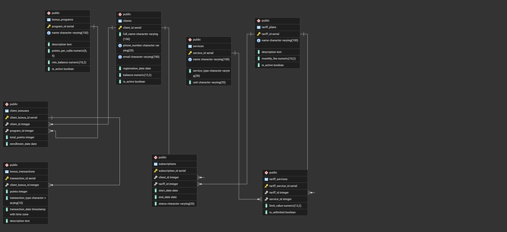

# РГР: База тарифных планов и бонусных программ

**Дисциплина:** Базы данных  

---

## 1. Описание предметной области

Система управляет **тарифными планами мобильного оператора** и **программами лояльности** для абонентов. Автоматизируются следующие бизнес-процессы:

- Учет клиентов и контроль их действий;
- Управление каталогом тарифных планов и входящих в них услуг (звонки, SMS, интернет, роуминг);
- Подключение/отключение клиентов к тарифным планам;
- Ведение бонусных программ лояльности: начисление и списание баллов за оплату услуг;
- Хранение полной истории бонусных транзакций для аналитики.

### Ключевые сущности

| Таблица              | Описание                                                        | PK                  | FK                              |
|----------------------|-----------------------------------------------------------------|---------------------|---------------------------------|
| `clients`            | Абоненты: ФИО, телефон, email, баланс                           | client_id           | —                               |
| `tariff_plans`       | Тарифные планы: название, стоимость, статус                     | tariff_id           | —                               |
| `services`           | Услуги: тип (звонки, SMS, интернет, роуминг), единица измерения | service_id          | —                               |
| `tariff_services`    | Состав тарифа: какие услуги и с какими лимитами включены        | tariff_service_id   | tariff_id, service_id           |
| `subscriptions`      | Подписки клиентов на тарифы с датами и статусом                 | subscription_id     | client_id, tariff_id            |
| `bonus_programs`     | Бонусные программы: название, курс начисления баллов            | program_id          | —                               |
| `client_bonuses`     | Участие клиента в программе, текущий баланс баллов              | client_bonus_id     | client_id, program_id           |
| `bonus_transactions` | История начислений и списаний бонусных баллов                   | transaction_id      | client_bonus_id                 |

---

## 2. Структура проекта

```
├── README.md        — описание
├── schema.sql       — создание таблиц, ограничений, индексов
├── data.sql         — тестовые данные
├── queries.sql      — 20 SQL-запросов
└── diagram.png      — ER-диаграмма
```

---

## 3. ER-диаграмма




### Связи между таблицами
 
**Связи 1:N (один ко многим)**
 
| Связь | Описание |
|-------|----------|
| `clients` -> `subscriptions` | Один клиент может иметь несколько подписок (например, менял тарифы) |
| `tariff_plans` -> `subscriptions` | Один тариф может быть подключён у множества клиентов |
| `clients` -> `client_bonuses` | Один клиент может участвовать в нескольких бонусных программах |
| `bonus_programs` -> `client_bonuses` | В одну программу может быть записано много клиентов |
| `client_bonuses` -> `bonus_transactions` | По каждому участию в программе накапливается история транзакций |
 
**Связи M:N (многие ко многим)**
 
| Связь | Таблица-посредник | Описание |
|-------|-------------------|-----------------|
| `tariff_plans` <-> `services` | `tariff_services` | Один тариф включает много услуг; одна услуга (например, интернет) входит во много тарифов. Таблица `tariff_services` хранит эту связь и дополнительно указывает лимит или признак безлимитности для каждой пары тариф–услуга.
---

## 4. Ограничения (CHECK / UNIQUE) и индексация

### UNIQUE

| Поле                                  | Обоснование                                                              |
|---------------------------------------|--------------------------------------------------------------------------|
| `clients.phone_number`                | Каждый абонент идентифицируется уникальным номером; дублирование невозможно |
| `clients.email`                       | Необязательный, но уникальный идентификатор для личного кабинета         |
| `tariff_plans.name`                   | Название тарифа — публичный идентификатор; дубликаты вводят в заблуждение |
| `bonus_programs.name`                 | Название программы лояльности уникально в маркетинговых материалах       |
| `tariff_services(tariff_id, service_id)` | Одна и та же услуга не может быть включена в тариф дважды             |
| `client_bonuses(client_id, program_id)`  | Клиент участвует в каждой бонусной программе не более одного раза     |

### CHECK

| Ограничение                                                                 | Обоснование                                                        |
|-----------------------------------------------------------------------------|--------------------------------------------------------------------|
| `clients.balance >= 0`                                                      | Баланс не может быть отрицательным (предоплатная система)          |
| `tariff_plans.monthly_fee >= 0`                                             | Стоимость тарифа не может быть отрицательной                       |
| `services.service_type IN (...)`                                            | Ограничивает допустимые типы услуг, исключая опечатки              |
| `(is_unlimited = TRUE) OR (limit_value IS NOT NULL AND limit_value >= 0)`   | Либо услуга безлимитная, либо задан конкретный неотрицательный лимит |
| `subscriptions.status IN ('active', 'suspended', 'terminated')`             | Конечный автомат статусов подписки                                 |
| `subscriptions.end_date > start_date`                                       | Дата окончания должна быть позже даты начала                       |
| `bonus_programs.points_per_ruble > 0`                                       | Ставка начисления баллов должна быть положительной                 |
| `bonus_transactions.points <> 0`                                            | Транзакция с нулём баллов бессмысленна                             |
| `bonus_transactions.transaction_type IN ('credit', 'debit')`                | Только два допустимых типа транзакции                              |

### Индексы

| Индекс                     | Поле                                     | Обоснование                                            |
|----------------------------|------------------------------------------|--------------------------------------------------------|
| `idx_clients_phone`        | `clients(phone_number)`                  | Самый частый запрос: поиск абонента по номеру телефона |
| `idx_subscriptions_client` | `subscriptions(client_id, status)`       | Фильтрация активных подписок конкретного клиента       |
| `idx_bonus_tx_date`        | `bonus_transactions(transaction_date)`   | Аналитические запросы по временным периодам            |
| `idx_subscriptions_tariff` | `subscriptions(tariff_id)`               | JOIN при отчёте «количество абонентов по тарифу»       |

---

## 5. Описание запросов (queries.sql)

| №  | Задача                                      | Используемые конструкции           |
|----|---------------------------------------------|------------------------------------|
| 1  | Реестр активных клиентов                    | SELECT + WHERE + ORDER BY          |
| 2  | Все тарифные планы                          | SELECT                             |
| 3  | Все услуги                                  | SELECT                             |
| 4  | Клиенты с балансом > 500                    | WHERE                              |
| 5  | Состав тарифа "Оптимальный"                 | JOIN (3 таблицы)                   |
| 6  | Активные клиенты и их тарифы                | JOIN + WHERE                       |
| 7  | Количество клиентов по тарифам (>1)         | GROUP BY + HAVING                  |
| 8  | Топ-3 клиента по баллам                     | GROUP BY + ORDER BY + LIMIT        |
| 9  | Транзакции за 2026 год                      | CTE (WITH)                         |
| 10 | Клиенты без бонусных программ               | подзапрос (NOT IN)                 |
| 11 | Список всех клиентов                        | SELECT                             |
| 12 | Список всех услуг                           | SELECT                             | 
| 13 | Список всех тарифов                         | SELECT                             |
| 14 | Клиенты с балансом > 750                    | WHERE                              |
| 15 | Только активные тарифы                      | WHERE                              |
| 16 | Клиенты и их тарифы                         | JOIN                               |
| 17 | Состав тарифов (услуги и лимиты)            | JOIN                               |
| 18 | Тарифы, где абонентов > 1                   | GROUP BY + HAVING                  |
| 19 | Бонусные баллы активных клиентов            | CTE (WITH)                         |
| 20 | Топ-5 клиентов по балансу                   | JOIN + GROUP BY + ORDER BY + LIMIT |
